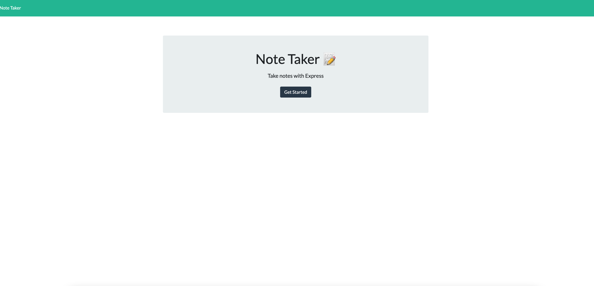
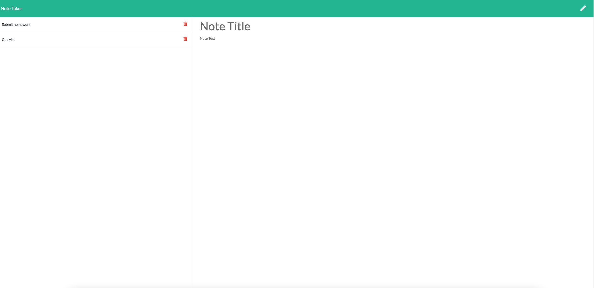

# Note Taker

---

## Description

Create an application from started codebase called Note Taker that can be used to write and save notes using an Express.js to retrieve note data from a JSON file. 

- When opening the Note Taker, the user is presented with a landing page with links to a note page.

- When the user clicks the link to the notes page, they are presented with a page with existing notes listed in the left-hand column, plus empty fields to enter a new note title and the note's text in the right-hand column.

- When the user enters a new note title and text, then a Save icon appears in the navigation bar at the top of the page.

- When the user clicks on the Save icon, then the new note is saved and appears in the left-hand column with the other existing notes.

- When an existing note in the list in the left-hand column is clicked, then that note appears in the right-hand column.

- When the user clicks the Write icon in the navigation bar at the top of the page, then they are presented with empty field to enter a new note title and text in the right-hand column.

---

## Table of Contents

- [Technology Used](#technology-used)

- [Links](#links)

- [Screenshots](#screenshots)

- [Usage](#usage)

- [Questions](#questions)

- [License](#license)

---

## Technology Used

- [Node.js](https://nodejs.org/en/)
- [Express package](https://www.npmjs.com/package/express)
- [GitHub](https://www.github.com)
- [Heroku](https://www.heroku.com)

---

## Links

- [GitHub Repository](https://github.com/hkhalfan1979/note-taker)
- [Deployed Application](https://whispering-ocean-37947.herokuapp.com/)

---

## Screenshots

---

## Usage

1. Open the website. (https://whispering-ocean-37947.herokuapp.com/)

2. Click the Get Started button.

3. Enter note title and description.

4. Click the Save.

5. You have an option to delete an entry.

---

## Questions

If you have any questions about the repo you can open an issue.

Hasnain Khalfan [Email](hkhalfan@gmail.com)

Github Profile [Github](https://github.com/hkhalfan1979/)

---

## License

This project is licensed under the [MIT License](https://choosealicense.com/licenses/mit).

---

